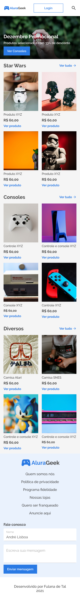
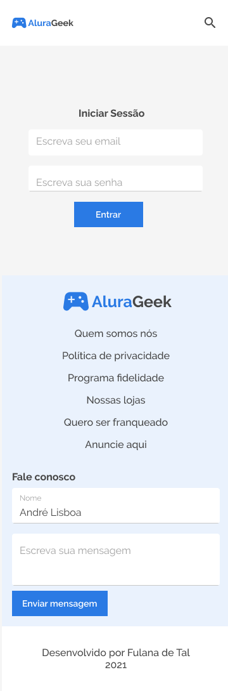
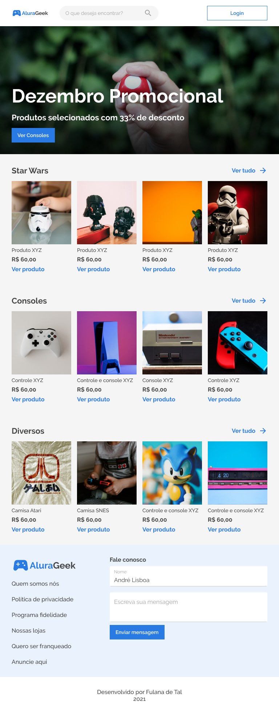
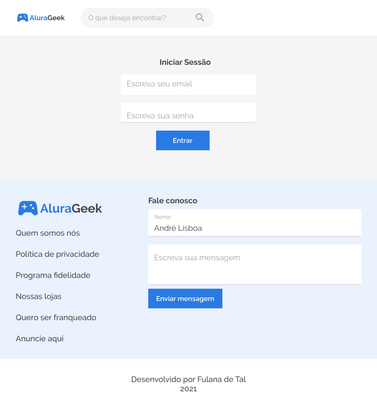
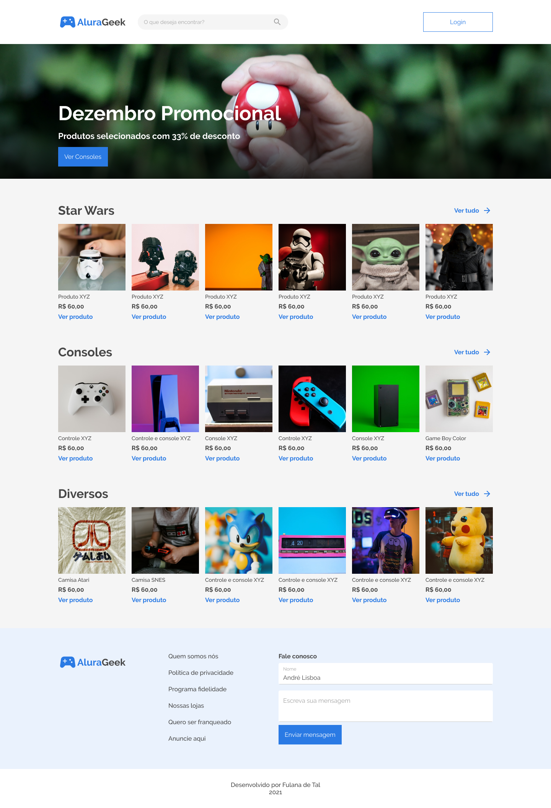

<h1></h1>

# Challenger Front-End - 5ª edição

---
## Descrição

Fui "contratado" para desenvolver um e-commerce para a empresa Alura Geek, onde eles pretendem alavancar as suas vendas adentrando na internet e que o site seja fácil de postar os produtos da loja e que tenha fácil navegação!

## Objetivos

Feito a pequena sinopse para situar o leitor, o desafio exige alguns requisitos obrigatórios propostos pela a equipe da Alura, sendo eles:

- Desenvolver o mesmo design disponibilizado no Figma;
- O site precisa ser responsívo - adaptar o layout da página de acordo o tamanho da tela do dispositivo;
- Precisa ter uma página administrativa para ser acessada pela empresa;
- E em cada semana, trabalhar com organização e fluxo de atividades usando o Trello.

---
## Imagens do projeto

|Mobile - Home|Mobile - Login|
|-----------------------------------------------|------------------------------------------------------|
|||

|Tablet - Home|Tablet - Login|
|-----------------------------------------------|------------------------------------------------------|
|||

|Desktop - Home|Desktop - Login|
|-----------------------------------------------|------------------------------------------------------|
|||

---
## Status do projeto

   

Para realizar o deploy eu estou usando o Vercel para hospedar a página. Caso queira visualizar como ela está atualmente basta [clicar aqui](alurageek-gamma.vercel.app)

### Primeira semana

*Dos dias 26 a 30 de Setembro de 2022*

 🎯 **Objetivos**

*Página Home*

- Adicionar o logo da empresa;
- Criar uma barra de pesquisa;
- Adicionar um botão para iniciar a sessão;
- Adicionar um banner de chamada;
- Criar as sessões de produtos, as quais foram *Star Wars*, *Consoles* e *Diversos*;
- Criar um rodapé com os links institucionais e com campos de input para o cliente deixar uma mensagem para a loja.

*Página Login*

- Usar elementos da pagina home como o cabeçalho e rodapé;
- No *main*, desenvolver a tela de login com a entrada do e-mail e senha do usuário.

>✍ **Minha opinião**
>
>Nessa primeira semana foi o desenvolvimento da página **Home** e a página de **Login**. Neste projeto, como uma forma de aprendizado, eu estou desenvolvendo totalemnte em HTML, CSS e JavaScript, pois na minha concepção é extremamente importante fundamentar a base antes de ter que trabalhar com algum framework, como Angula, React, Vue, e dentre outros.
>
>Entretanto só no desenvolvimento dessas duas páginas eu já estou pensando em uma forma de conseguir componetizar cada parte do site sem ter que utilizar um framework. Uma coisa que eu sei é que eu tenho que começar por Web Components. 😋
>
>Então, nessa primeira semana o meu site ainda estará somente com HTML e CSS. Estou adquirindo mais conhecimento para chegar no objetivo. 😉
>
---

### Segunda semana

### Terceira semana

### Quarta semana

## Contato

Fique a disposição para entrar em contato comigo. Estou presente nas seguintes redes sociais:

 